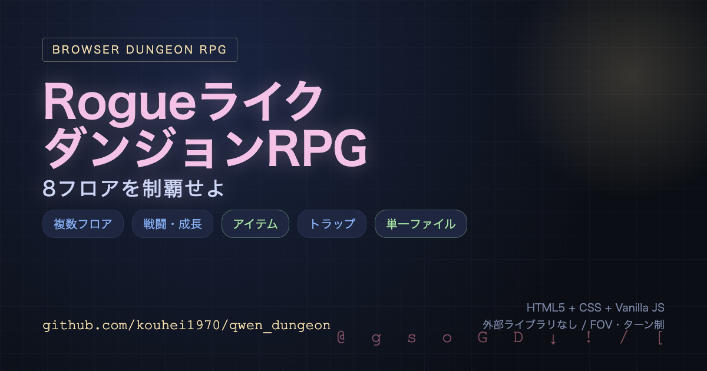

# ⚔ Rogueライク ダンジョンRPG

ブラウザで遊べる、単一ファイルのダンジョンクロウラーRPG。
HTML5 + CSS + Vanilla JS のみで実装（外部ライブラリなし）。

[](https://kouhei1970.github.io/qwen_dungeon/)

## ▶ 遊び方

- **オンライン版:** [https://kouhei1970.github.io/qwen_dungeon/](https://kouhei1970.github.io/qwen_dungeon/)
- **ローカルで遊ぶ:** `index.html` をブラウザで開く（file:// でも可）

## 概要

8フロアからなるダンジョンを探索し、最深部を目指そう。
ターン制の戦闘、レベルアップ、アイテム装備、トラップなど、
Rogueライクの基本要素がすべて入っている。

### 特徴

- **複数フロア** — 階段(↓)で自動下降、最終フロア到達で勝利
- **戦闘・成長** — ターン制バトル、敵を倒してXP獲得→レベルアップ（HP/MP/攻撃/防御上昇）
- **アイテム** — 武器・防具の自動装備（強い方を選択）、ポーションでHP回復
- **トラップ** — 踏むまで見えない。踏むとダメージ（一度きり）

## 操作方法

| キー | 動作 |
|------|------|
| 矢印 / WASD | 移動・攻撃 |
| 空白 | 待機 |
| `e` | アイテム拾う |
| `q` | 装備表示 |
| `p` | ポーション使用 |
| 階段(↓) | 自動下降 |

## 敵一覧（階層で強化）

| 名前 | 記号 | HP | ATK | DEF | XP |
|------|------|----|----|-----|-----|
| ゴブリン | `g` | 8 | 3 | 1 | 5 |
| スライム | `s` | 12 | 4 | 0 | 7 |
| オーク | `o` | 18 | 6 | 3 | 12 |
| ゴースト | `G` | 14 | 8 | 2 | 15 |
| ドラゴン | `D` | 30 | 12 | 6 | 40 |

## 技術構成

- **形式:** 単一ファイル `index.html`（HTML + CSS + JS）
- **外部依存:** なし
- **描画:** Canvas 2D（FOVで可視範囲のみ表示）
- **マップ生成:** ランダム部屋 → L字廊下で接続、階層で敵/アイテム/トラップ密度調整
- **FOV:** 半径7のビーム走査、壁で遮断

## ファイル構成

```
qwen_dungeon/
├── index.html          # ゲーム本体（単一ファイル）
├── card.html           # SNS用カード（1200×630 OGP）
├── docs/
│   └── og-image.png    # 公開用OGP画像
├── .github/workflows/
│   └── pages.yml       # GitHub Pages デプロイ
├── PLAN.md             # 作業計画
└── PROGRESS.md         # 進捗記録
```

## ライセンス

自由に使ってください。
